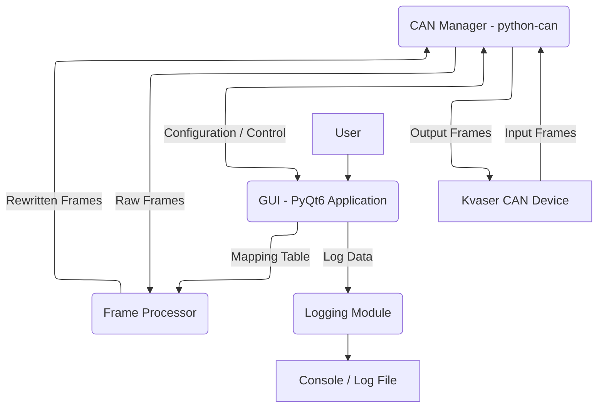

# CAN Frame Retransmission Tool (SRS)

---

## Purpose

This Software Requirements Specification (SRS) document defines the functional and non-functional requirements for a PyQt6-based Python desktop application. The primary purpose of this application is to detect and interface with Kvaser CAN devices, allowing users to select distinct input and output CAN channels, configure bitrates, and retransmit CAN frames from the input to the output channel after rewriting their CAN IDs based on a user-defined mapping table.

### Objectives

The main objectives of this software are:

* To provide a user-friendly graphical interface for configuring CAN retransmission.
* To enable reliable detection and selection of Kvaser CAN devices and channels.
* To facilitate the real-time retransmission of CAN frames with configurable ID rewriting.
* To offer clear status feedback and display of the latest received frames.

### Scope

**The system shall perform the following functions:**

* Detect and list available Kvaser CAN devices and their channels.
* Allow user selection of one input and one output CAN channel, ensuring they are distinct.
* Allow user configuration of bitrate for input and output channels, defaulting to 250 kbps.
* Implement a "Start/Stop frame retransmission" mechanism.
* Display a real-time view of the latest received CAN frames.
* Provide a status indicator for the retransmission process.
* Apply user-configurable CAN ID rewriting rules.
* Log system events and CAN frame activity to the console and an optional file.

**The system shall NOT perform the following functions:**

* Perform any database operations or data persistence beyond logging.
* Decode CAN frames using DBC files or interpret their payload beyond raw data.
* Control or modify any physical actuators or external systems based on CAN frame content.
* Support CAN devices other than Kvaser via the `python-can` Kvaser backend.
* Provide network-based remote control or monitoring.

### Validity

This SRS document is considered valid from the date of its initial publication (Version 1.0) and will remain in force until a new version explicitly replaces it. Any changes, additions, or deletions of requirements must be managed through the defined update scheme and documented in subsequent versions.

### Update Scheme

Updates to this SRS document will be carried out through a formal change control process. All significant modifications must be reviewed, approved, and documented in the `Version History` table at the beginning of the document, including the version number, a concise description of the changes, the date of modification, and the responsible author. Minor versions may be internally documented and published as necessary, but will not be formally released until they meet the criteria for a major version update.

## Referenced Documents

[DOC-001]: (SRVP.md)

|Ref. No. |Doc. Number     |Version    |Title                                                                       |
|:--------|:-----------    |:----------|:---------------------------------------------------------------------------|
| /1/     | XXXXXXX        | Latest    | [(SRVP) for CAN Frame Retransmission Too][DOC-001]                                     |

## Definitions

### Abbreviations

| Abbreviation | Definition                                 |
| :----------- | :----------------------------------------- |
| **CAN**      | Controller Area Network                    |
| **DLC**      | Data Length Code                           |
| **GUI**      | Graphical User Interface                   |
| **ID**       | Identifier                                 |
| **kbps**     | Kilobits per second                        |
| **NFR**      | Non-Functional Requirement                 |
| **SRS**      | Software Requirements Specification        |
| **SRVP**     | Software Requirements Verification Plan    |
| **TBD**      | To Be Determined                           |
| **SRAC**     | Safety Related Application Condition       |

### Terms

| Term                     | Definition                                                                                            |
|:-------------------------|:------------------------------------------------------------------------------------------------------|
| **CAN Channel**          | A logical communication path on a CAN bus, typically tied to a physical port.                         |
| **CAN Frame**            | A single message unit transmitted on a CAN bus, comprising ID, DLC, and Data.                         |
| **Bitrate**              | The data transmission speed on a CAN bus, measured in bits per second.                                |
| **Retransmission**       | The act of receiving a CAN frame and sending it again, possibly modified.                             |
| **CAN ID Rewrite Rule**  | A user-defined mapping from an input CAN ID to an output CAN ID.                                      |
| **Bus-Off**              | An error state in a CAN controller where it stops participating on the bus due to excessive errors.   |
| `python-can`             | A Python library providing common interfaces to various CAN hardware.                                 |
| **Kvaser Backend**       | A specific `python-can` interface for Kvaser CAN hardware.                                            |

### Nomenclature

| Nomenclature      | Description                                      |
|:------------------|:-------------------------------------------------|
| `REQ-FUNC-INT-XXX`| Functional Interface Requirement                 |
| `REQ-FUNC-LOG-XXX`| Functional Logic Requirement                     |
| `REQ-NFR-XXX`     | Non-functional Requirement                       |
| `REQ-NFR-PER-XXX` | Non-functional Performance Requirement           |
| `REQ-NFR-POR-XXX` | Non-functional Portability Requirement           |
| `REQ-NFR-USA-XXX` | Non-functional Usability Requirement             |
| `REQ-NFR-SAF-XXX` | Non-functional Safety Requirement                |
| `REQ-NFR-REL-XXX` | Non-functional Reliability Requirement           |
| `REQ-NFR-MNT-XXX` | Non-functional Maintainability Requirement       |

## Definition of the System and the System Boundaries

### General Information

The CAN Frame Retransmission Tool is a desktop application designed for engineers and developers working with CAN bus systems. It simplifies the process of testing and debugging CAN networks by allowing flexible retransmission and ID modification of CAN messages without needing complex hardware setups.

### Definition of the System

The system is a standalone Python application, utilizing the PyQt6 framework for its GUI and the `python-can` library with the Kvaser backend for CAN communication. Its core function is to facilitate the flow of CAN frames between two distinct Kvaser CAN channels, applying a user-configurable ID rewrite mapping.

#### System Architecture

The system consists of the following main components:

* **GUI (PyQt6):** Provides the user interface for configuration, control, and monitoring.
* **CAN Manager:** Wraps `python-can` functionalities for device and channel management.
* **Frame Processor:** Applies CAN ID rewriting rules based on user configuration.
* **Logging Module:** Manages logging of application events and errors.

The following diagram illustrates the system architecture:

<!-- [MermaidChart: 4c25a8ed-02e0-4709-8952-3df4cf91a5e7] -->

### System Boundaries

**The system SHALL perform the following actions:**

* Poll for and display available Kvaser CAN devices and their channels.
* Validate user input for channel selection (input and output channels must be unique).
* Open and close CAN bus connections via `python-can`.
* Continuously monitor the selected input CAN channel for incoming frames when retransmission is active.
* Apply the CAN ID mapping table to frames received on the input channel.
* Transmit modified frames to the selected output CAN channel.
* Provide visual feedback on the operational status of the retransmission process.
* Allow dynamic modification of the CAN ID mapping table during runtime (when retransmission is stopped).
* Handle and report errors related to CAN communication (e.g., bus-off, device not found).

**The system SHALL NOT perform the following actions:**

* Manage or install Kvaser device drivers. It assumes drivers are pre-installed.
* Provide an API for external systems to interact with it.
* Persist configuration or logging data across application restarts, unless explicitly configured for file logging.
* Interact with the operating system beyond standard file I/O for logging and GUI rendering.

## Functional Requirements

### Interfaces

| Requirement ID        | Description                                                                                                                                                                    | Priority |
|:----------------------|:-------------------------------------------------------------------------------------------------------------------------------------------------------------------------------|:---------|
| REQ-FUNC-INT-001      | The system SHALL detect and list all available Kvaser CAN devices and their respective channels using the `python-can` Kvaser backend.                                         | High     |
| REQ-FUNC-INT-002      | The system SHALL prompt the user to select an input CAN channel and an output CAN channel from the list of detected channels.                                                  | High     |
| REQ-FUNC-INT-003      | The system SHALL validate that the selected input and output CAN channels are distinct.                                                                                        | High     |
| REQ-FUNC-INT-004      | The system SHALL prompt the user to set the CAN bitrate for both the input and output channels.                                                                                | High     |
| REQ-FUNC-INT-005      | The system SHALL default the bitrate for both input and output channels to 250 kbps if not explicitly set by the user.                                                         | Medium   |
| REQ-FUNC-INT-006      | The system SHALL allow the user to define a mapping table for rewriting CAN IDs.                                                                                               | High     |
| REQ-FUNC-INT-007      | The system SHALL validate that all "Original CAN ID" and "Rewritten CAN ID" entries in the mapping table are valid standard (11-bit) or extended (29-bit) hexadecimal CAN IDs. | High     |
| REQ-FUNC-INT-008      | The system SHALL provide a "Start/Stop Frame Retransmission" button on the GUI.                                                                                                | High     |
| REQ-FUNC-INT-009      | The system SHALL display a status indicator on the GUI.                                                                                                                        | High     |
| REQ-FUNC-INT-010      | The system SHALL display a table or list view of the latest received CAN frames on the GUI.                                                                                    | High     |

### Functions

| Requirement ID        | Description                                                                                                                                                                    | Priority |
|:----------------------|:-------------------------------------------------------------------------------------------------------------------------------------------------------------------------------|:---------|
| REQ-FUNC-LOG-001     | Upon clicking "Start Frame Retransmission", the system SHALL transition to a "Listening" state and open both the input and output CAN channels with the configured bitrates.    | High     |
| REQ-FUNC-LOG-002     | While in "Listening" or "Receiving" state, the system SHALL continuously monitor the selected input CAN channel for incoming frames.                                            | High     |
| REQ-FUNC-LOG-003     | Upon receiving a CAN frame on the input channel, the system SHALL log the frame with a timestamp and update the GUI's latest frames view.                                       | High     |
| REQ-FUNC-LOG-004     | For each received CAN frame, the system SHALL attempt to rewrite its CAN ID based on the user-configured mapping table.                                                         | High     |
| REQ-FUNC-LOG-005     | The system SHALL forward the (potentially rewritten) CAN frame to the selected output CAN channel.                                                                              | High     |
| REQ-FUNC-LOG-006     | Upon clicking "Stop Frame Retransmission", the system SHALL cease listening, close both CAN channels, and transition to a "Stopped" state.                                      | High     |
| REQ-FUNC-LOG-007     | The system SHALL handle errors during CAN device detection or channel opening (e.g., no Kvaser devices found, device in use, access denied).                                    | High     |
| REQ-FUNC-LOG-008     | The system SHALL handle bitrate mismatches between the configured bitrate and the actual bus bitrate if detected by the `python-can` backend.                                   | Medium   |
| REQ-FUNC-LOG-009     | The system SHALL detect and report a CAN bus-off condition on either the input or output channel.                                                                               | High     |
| REQ-FUNC-LOG-010     | The system SHALL provide configurable console logging for operational events (e.g., start/stop, channel status, errors).                                                        | Medium   |

## Non-functional Requirements

| Requirement ID        | Description                                                                                                                                                                    | Priority |
|:----------------------|:-------------------------------------------------------------------------------------------------------------------------------------------------------------------------------|:---------|
| REQ-NFR-REL-001      | The system SHALL attempt to auto-recover from a temporary bus-off state on an active CAN channel by re-initializing the channel after a short delay (e.g., 5 seconds), up to a configurable number of retries. | Medium |
| REQ-NFR-REL-002      | The system SHALL manage memory usage such that it does not exceed 200 MB during continuous operation for 24 hours under a typical CAN bus load (e.g., 5000 frames/second).      | High      |
| REQ-NFR-REL-003      | The system SHALL utilize robust error handling mechanisms that catch and report exceptions from `python-can` and PyQt6, preventing application crashes where possible.          | High      |
| REQ-NFR-MNT-001      | The system SHALL be structured with clear separation of concerns (e.g., GUI logic, CAN communication logic, data processing logic) to facilitate future modifications and extensions. | High   |
| REQ-NFR-MNT-002      | The system SHALL provide comprehensive documentation for its architecture, APIs, and usage scenarios to assist developers in understanding and extending the system.            | Medium    |
| REQ-NFR-SAF-001      | The system SHALL explicitly state that it is not intended for controlling safety-critical systems or actuators.                                                                 | High      |
| REQ-NFR-SAF-002      | The system SHALL warn the user about the potential for unintended side effects when retransmitting and modifying CAN frames on an active bus.                                   | High      |
| REQ-NFR-POR-001      | The system SHALL be compatible with Windows 11 operating system.                                                                                                                | High      |
| REQ-NFR-POR-002      | The system SHALL be developed using Python 3.10 or a later compatible version.                                                                                                  | High      |
| REQ-NFR-POR-003      | The system SHALL utilize the PyQt6 framework for its Graphical User Interface.                                                                                                  | High      |
| REQ-NFR-POR-004      | The system SHALL exclusively use the `python-can` library with the Kvaser backend for all CAN communication, assuming Kvaser drivers are installed on the host OS.              | High      |
| REQ-NFR-USA-001      | The GUI SHALL remain responsive to user input (e.g., button clicks, dropdown selections) while CAN retransmission is active.                                                    | High      |
| REQ-NFR-USA-002      | The "Latest Frames" view SHALL display timestamps with millisecond precision, clearly indicating when each frame was received.                                                  | High      |
| REQ-NFR-USA-003      | The CAN ID mapping table SHALL be intuitive to edit, allowing users to add, modify, and delete entries easily.                                                                  | High      |
| REQ-NFR-USA-004      | Error messages and status indicators SHALL be clear, concise, and provide actionable information to the user.                                                                   | High      |

### Maintainability and Reliability

See `REQ-NFR-REL-001, REQ-NFR-REL-002` and `REQ-NFR-REL-003`
See `REQ-NFR-MNT-001` and `REQ-NFR-MNT-002`

### Safety

See `REQ-NFR-SAF-001` and `REQ-NFR-SAF-002`

### Safety Related Application Conditions (SRACs)

No specific SRACs beyond the general safety warnings, as this application is explicitly not designed for safety-critical control. It is a diagnostic and development tool.

### Portability

See `REQ-NFR-POR-001`, `REQ-NFR-POR-002`, `REQ-NFR-POR-003` and `REQ-NFR-POR-004`.

### Usability

See `REQ-NFR-USA-001`, `REQ-NFR-USA-002`, `REQ-NFR-USA-003`, and `REQ-NFR-USA-004`.

## References

### Used References
